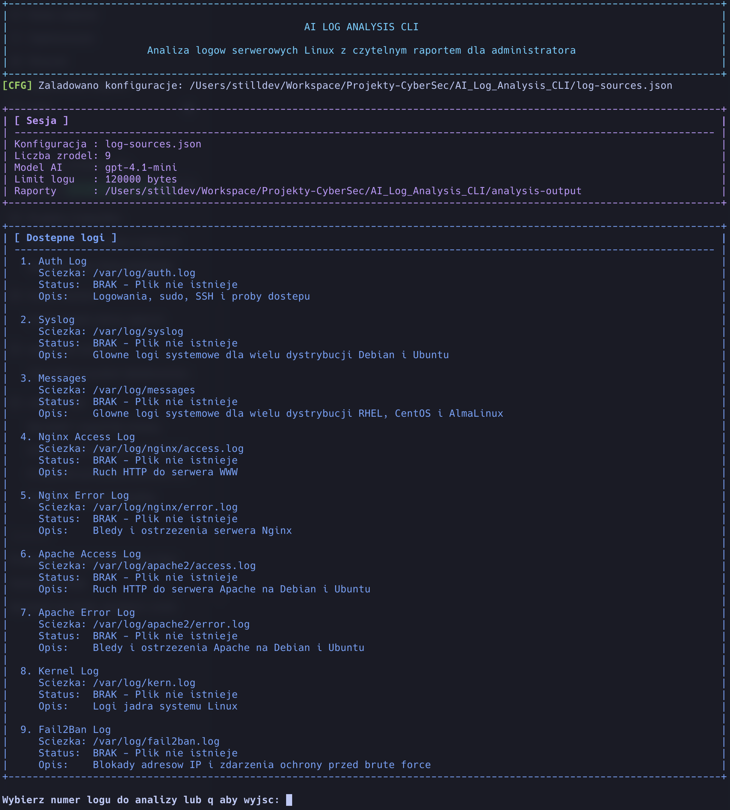
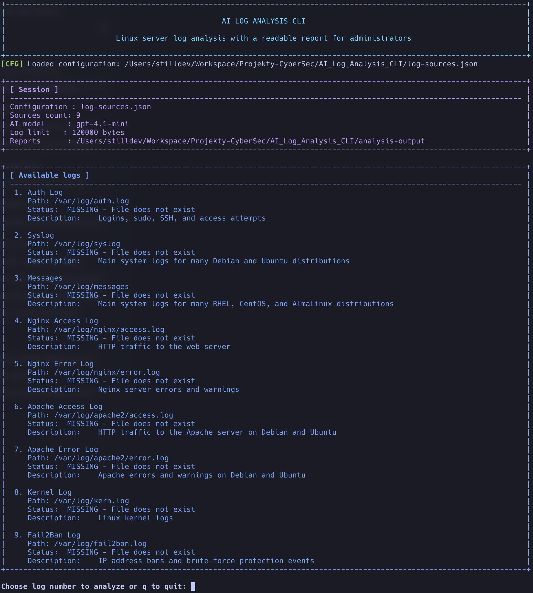

# AI Log Analysis CLI

`Python` `CLI` `Linux` `OpenAI` `Markdown Export` `JSON Export` `PL/EN`

CLI do analizy logow serwerowych Linux przy pomocy AI. Projekt laczy szybka lokalna analize techniczna z raportem generowanym przez model OpenAI.

## Features

- interaktywny tryb CLI z menu wyboru logow
- tryb bez interakcji do uzycia w cronach i skryptach
- filtr czasu: `none`, `1h`, `24h`, `7d`, wlasny zakres `from-to`
- lokalna analiza techniczna przed wywolaniem AI
- heurystyki bezpieczenstwa: brute force, skanowanie, timeouty, upstream, 4xx, 5xx
- eksport wyniku do `Markdown` i `JSON`
- dwa jezyki interfejsu i raportu AI: `pl`, `en`
- dziala na `Python 3` bez `Node.js`, `npm` i `Next.js`

## Screenshots

### Polish CLI



### English CLI



## Requirements

- `Python 3`
- klucz OpenAI API ustawiony w `OPENAI_API_KEY`
- dostep do logow, ktore chcesz analizowac

## Quick Start

```bash
git clone https://github.com/<your-username>/AI_Log_Analysis_CLI.git
cd AI_Log_Analysis_CLI
cp .env.example .env
cp log-sources.example.json log-sources.json
# uzupelnij OPENAI_API_KEY w pliku .env
python3 main.py
```

## Config Files

Dostepne gotowe konfiguracje:

- `log-sources.json` - ogolna lista mieszana
- `log-sources.debian-ubuntu.json` - Debian / Ubuntu
- `log-sources.rhel-almalinux.json` - RHEL / CentOS / AlmaLinux

## Interactive Usage

```bash
python3 main.py
python3 main.py --config log-sources.debian-ubuntu.json
python3 main.py --lang en
```

## Non-Interactive Usage

```bash
python3 main.py --source 1 --time 1h
python3 main.py --source "Auth Log" --time 24h
python3 main.py --source 4 --time-start "2026-07-13 10:00" --time-end "2026-07-13 18:00"
python3 main.py --config log-sources.debian-ubuntu.json --source 4 --time 24h --lang en
```

## Time Filter

Obslugiwane opcje:

- `none`
- `1h`
- `24h`
- `7d`
- `--time-start` + `--time-end`

Dla wlasnego zakresu uzyj formatu:

```text
YYYY-MM-DD HH:MM
YYYY-MM-DD HH:MM:SS
```

Program probuje rozpoznawac typowe znaczniki czasu z logow `syslog`, `auth.log`, `nginx`, `apache` i logow w formacie ISO.

## Output

Po kazdej analizie program zapisuje:

- raport tekstowy `.md`
- raport strukturalny `.json`

Pliki trafiaja do katalogu `analysis-output`.

## Security / Privacy

To bardzo wazne: tresc analizowanego logu jest wysylana do API OpenAI.

Przed publikacja lub uzyciem w srodowisku produkcyjnym upewnij sie, ze:

- wolno Ci wysylac te logi poza serwer
- logi nie zawieraja danych, ktorych nie chcesz udostepniac zewnetrznemu dostawcy AI
- zakres czasu i rozmiar logu sa ograniczone do niezbednego minimum

Jesli potrzebujesz bardziej restrykcyjnego modelu pracy, kolejnym krokiem powinno byc maskowanie danych wrazliwych przed wysylka.

## Language Support

Mozesz uruchomic program po polsku albo po angielsku:

```bash
python3 main.py --lang pl
python3 main.py --lang en
```

Parametr `--lang` zmienia:

- interfejs CLI
- lokalne sekcje analityczne
- prompt do AI
- zapis raportu Markdown i JSON
- opisy zrodel logow, jesli konfiguracja zawiera pola `name_pl` / `name_en` oraz `description_pl` / `description_en`

## Environment Variables

Program automatycznie wczytuje plik `.env` z katalogu roboczego. Zmienne ustawione juz w srodowisku (np. przez `export`) maja pierwszenstwo przed wartosciami z `.env`.

- `OPENAI_API_KEY` - wymagany klucz API
- `OPENAI_MODEL` - model, domyslnie `gpt-4.1-mini`
- `LOG_MAX_BYTES` - limit bajtow wysylanych do AI, domyslnie `120000`
- `AI_LOG_LANG` - domyslny jezyk `pl` albo `en`
- `NO_COLOR=1` - wylacza kolory terminala

## Example `.env`

```bash
OPENAI_API_KEY=your_api_key_here
OPENAI_MODEL=gpt-4.1-mini
LOG_MAX_BYTES=120000
AI_LOG_LANG=pl
```

## Roadmap

- dodanie maskowania danych wrazliwych przed wysylka do AI
- rozbudowa parserow dla kolejnych typow logow
- eksport raportu do dodatkowych formatow
- gotowe integracje z cronem, systemd i SIEM

## Publishing Notes

W obecnej formie projekt nadaje sie na GitHuba jako MVP / prototype. Nie jest jeszcze pelnym narzedziem klasy enterprise ani SIEM-em, ale jest juz praktycznym CLI do wspomaganej AI analizy logow.

## License

Projekt korzysta z licencji `MIT`.
